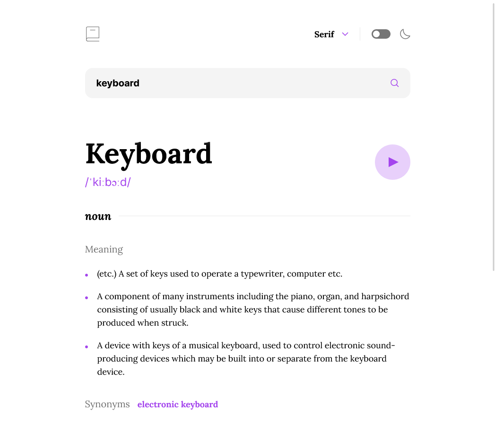

# Frontend Mentor - Dictionary web app solution

This is a solution to the [Dictionary web app challenge on Frontend Mentor](https://www.frontendmentor.io/challenges/dictionary-web-app-h5wwnyuKFL). Frontend Mentor challenges help you improve your coding skills by building realistic projects.

## Table of contents

- [Frontend Mentor - Dictionary web app solution](#frontend-mentor---dictionary-web-app-solution)
  - [Table of contents](#table-of-contents)
  - [Overview](#overview)
    - [The challenge](#the-challenge)
    - [Screenshot](#screenshot)
    - [Links](#links)
  - [My process](#my-process)
    - [Built with](#built-with)
    - [What I learned](#what-i-learned)
    - [Continued development](#continued-development)
    - [Useful resources](#useful-resources)
  - [Author](#author)

## Overview

### The challenge

Users should be able to:

- Search for words using the input field
- See the Free Dictionary API's response for the searched word
- See a form validation message when trying to submit a blank form
- Play the audio file for a word when it's available
- Switch between serif, sans serif, and monospace fonts
- Switch between light and dark themes
- View the optimal layout for the interface depending on their device's screen size
- See hover and focus states for all interactive elements on the page

### Screenshot

### Links

- Solution URL: [Add solution URL here](https://your-solution-url.com)
- Live Site URL: [Add live site URL here](https://your-live-site-url.com)

## My process

### Built with

- [React](https://reactjs.org/) - JS library
- [React Router](https://reactrouter.com/) - Routing library for React
- [Tailwindcss](https://tailwindcss.com/) - CSS framework
- [Framer Motion](https://www.framer.com/motion/) - Animation library for React

### What I learned

This challenge made me realize the strategic importance of choosing one framework over the other. It is crucial that this decision be informed by a thorough consideration of the nature and needs of the project itself, not just the preferences of the developer.
This has also been an opportunity for me to step out of the NextJS way and experience things differently. Insightful stuff.
The challenge was rich enough for me to get to practice most of the things I learned along the way.

### Continued development

Accessibility, type safety & peformance optimization are all fronts that I want to tackle as soon as I'm comfortable with the more foundational frontend skills.

### Useful resources

- [The official React Router Tutorial](https://reactrouter.com/en/main/start/tutorial) - This had a foundational role in preparing me for this challenge, since this is my first bout with version 6.4 and the object based browserouter.
- [useToggle hook by useHooks](https://usehooks.com/useToggle/) - This is where I got the toggle hook that I used for the theme toggler and the font picker.
- [useLocalstorage hook by Shadee Merhi](https://www.youtube.com/watch?v=BHQ_M8wc770) - Thanks to Shadee Merhi for the sharing the localstorage consumption hook that he himself obtained from ChatGPT.

## Author

- Website - [Ayoub Ahabchane](https://www.ayoub.codes)
- Frontend Mentor - [@ayoub-ahabchane](https://www.frontendmentor.io/profile/ayoub-ahabchane)
- Twitter - [@Ayoub_Ahabchane](https://twitter.com/Ayoub_Ahabchane)
